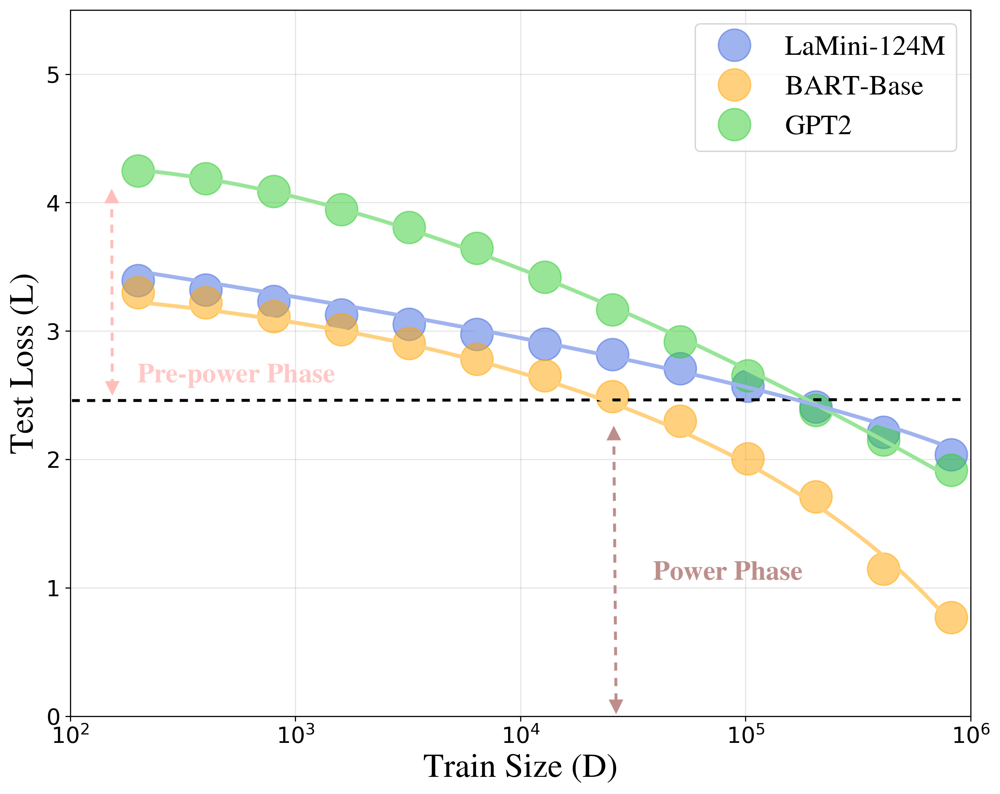
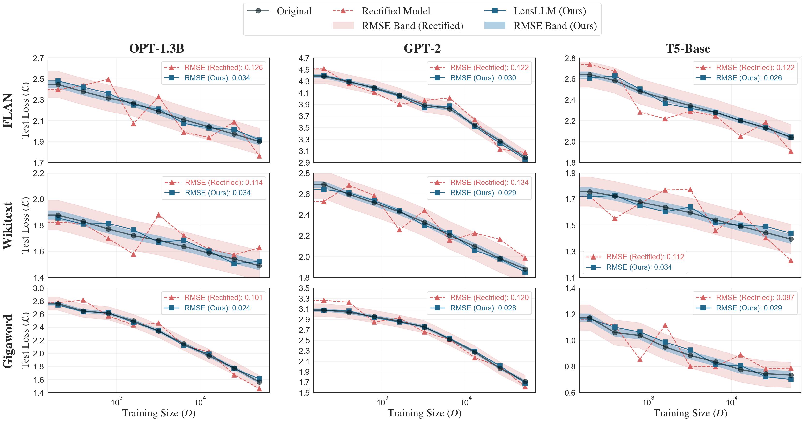
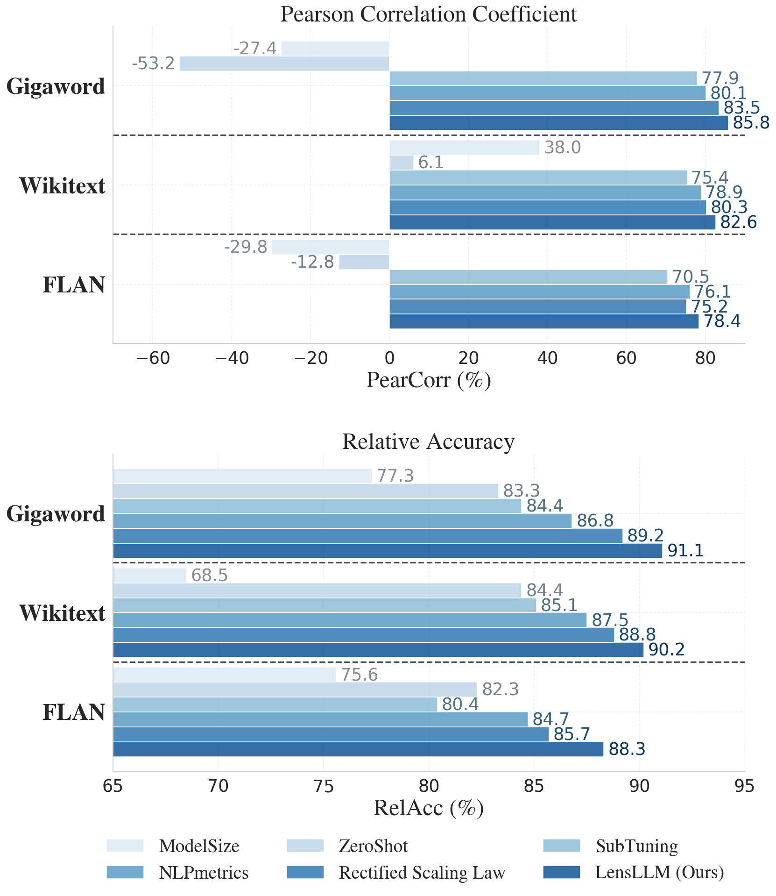
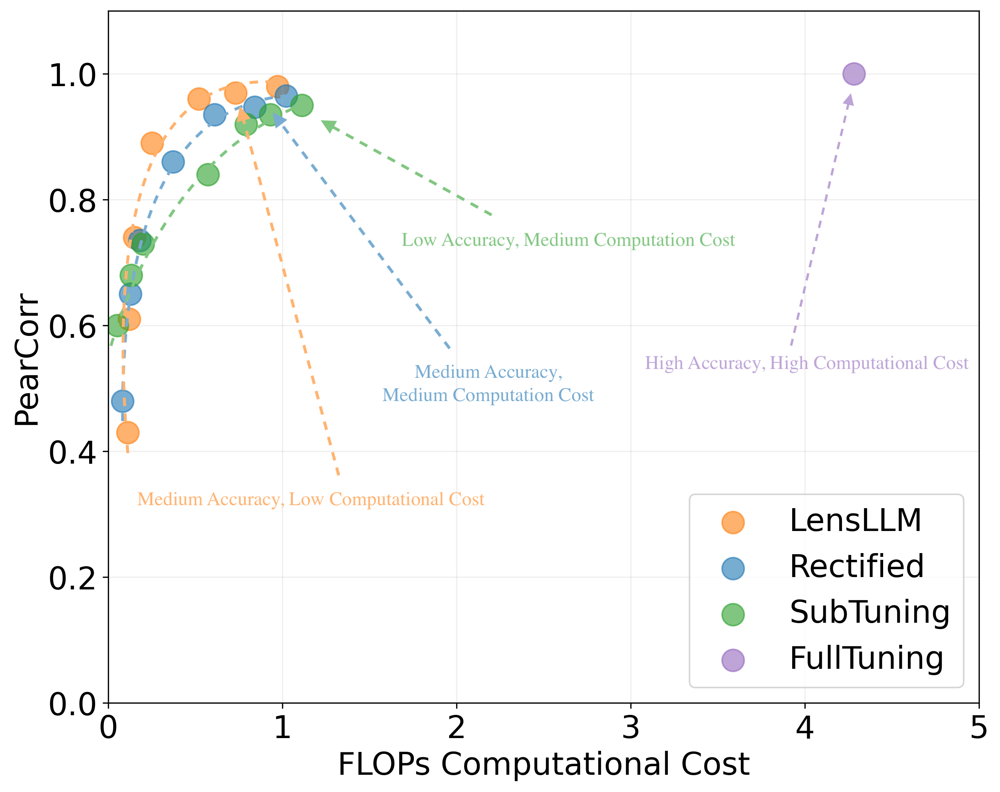

# <a href="https://arxiv.org/abs/2505.03793" style="color: black !important;">LENSLLM: Unveiling Fine-Tuning Dynamics for LLM Selection</a>

**Xinyue Zeng¹**, **Haohui Wang¹**, **Junhong Lin²**, **Jun Wu³**, **Tyler Cody¹**, **Dawei Zhou¹**

¹ Virginia Tech, ² MIT, ³ Michigan State University

---

## 📌 Abstract
The proliferation of open-sourced Large Language Models (LLMs) and diverse downstream tasks necessitates efficient model selection, given the impracticality of fine-tuning all candidates due to computational constraints. Despite the recent advances in LLM selection, a fundamental research question largely remains nascent: *how can we model the dynamic behaviors of LLMs during fine-tuning, thereby enhancing our understanding of their generalization performance across diverse downstream tasks?*

In this work, we propose a novel theoretical framework that provides a proper lens to assess the generalization capabilities of LLMs, thereby enabling accurate and efficient LLM selection for downstream applications. In particular, we first derive a **PAC-Bayesian Generalization Bound** that unveils the fine-tuning dynamics of LLMs and then introduce **LENSLLM**, a **Neural Tangent Kernel (NTK)-based Rectified Scaling Model** that enables accurate performance predictions across diverse tasks while maintaining computational efficiency. Extensive empirical results on **three large-scale benchmarks** demonstrate that our model achieves **up to 91.1% accuracy** and reduces **up to 88.5% computational cost** in LLM selection, outperforming five state-of-the-art methods.

## 🔍 Understanding Fine-tuning Dynamics for LLM Selection: Pre-power and Power Phases

Our analysis reveals two distinct phases in LLM fine-tuning dynamics that are crucial for model selection:

### Pre-power Phase
The pre-power phase represents the initial stage of fine-tuning where models exhibit rapid performance improvements. During this phase:
- Models show high sensitivity to parameter updates
- Performance improvements are non-linear and often dramatic
- The NTK matrix undergoes significant changes
- Model behavior is highly dynamic and task-specific

### Power Phase
The power phase emerges after the initial rapid improvements, characterized by:
- More stable and predictable performance scaling
- Linear or power-law relationship between data size and performance
- Stabilized NTK matrix structure
- More consistent behavior across different tasks



*Figure: Comparison of different model selection approaches across pre-power and power phases. Our LENSLLM framework demonstrates superior performance in both phases, with particularly strong results in the pre-power phase where traditional methods often struggle.*

Understanding these phases is crucial for LLM selection because:
1. Different models may enter the power phase at different data scales
2. Performance predictions need to account for both phases
3. Model selection strategies should be phase-aware
4. Computational efficiency can be optimized by leveraging phase-specific behaviors

Our LENSLLM framework explicitly models both phases, enabling more accurate performance predictions and efficient model selection across the entire fine-tuning spectrum.

## 📊 Theoretical Foundation: PAC-Bayesian Generalization Bound

Our theoretical analysis reveals a fundamental connection between the fine-tuning phases and model generalization through a novel PAC-Bayesian bound. For any $\epsilon > 0$, with probability over 0.99, under our established assumptions, the generalization error bound takes the form:

$$L(f_{\hat{w}}) \leq (1 + \epsilon)\hat{L}(f_{\hat{w}}) + C_3 n^{-\beta_3} + O(n^{-\frac{3}{4}})$$

where $C_3 = \sqrt{C\cdot l \cdot C_2}$ and $\beta_3 = \frac{\beta_2+1}{2}$ are model and task-dependent constants.

### Connection to Fine-tuning Phases

This bound provides a theoretical foundation for understanding the two distinct phases of fine-tuning:

#### Pre-power Phase
- Characterized by the $O(n^{-\frac{3}{4}})$ term dominating the error bound
- High Hessian values indicate significant parameter sensitivity
- Performance improvements are gradual and require careful tuning
- Substantial data is needed for reliable model adaptation

#### Power Phase
- Dominated by the $C_3n^{-\beta_3}$ term in the error bound
- Reduced Hessian values lead to enhanced stability
- Enables more aggressive parameter updates
- Improved data efficiency in learning

#### Phase Transition
The transition between phases is mathematically captured by the change in dominant terms:
- From $O(n^{-\frac{3}{4}})$ in pre-power phase
- To $C_3n^{-\beta_3}$ in power phase
- This shift reflects the evolution of Hessian values and parameter sensitivity

## Empirical Results

Our theoretical framework is validated through extensive experiments across multiple benchmarks and model architectures:


*Figure: Performance curve fitting across different model sizes and datasets, demonstrating the accuracy of our theoretical predictions.*


*Figure: Comparison of different model selection approaches, showing LENSLLM's superior performance in identifying optimal models.*


*Figure: Computational cost efficiency analysis on the Gigaword dataset, demonstrating significant resource savings.*

### Test Loss Prediction Performance

The following table presents a comprehensive comparison of test loss prediction accuracy between our approach and the Rectified Scaling Law across multiple models and datasets:

| Model | Wikitext | FLAN | Gigaword |
|-------|----------|------|-----------|
| | Ours | Rect | Ours | Rect | Ours | Rect |
| OPT-350M | **0.2** | 1.10 | **0.32** | 1.50 | **0.26** | 0.98 |
| OPT-1.3B | **0.32** | 1.14 | **0.32** | 1.20 | **0.28** | 0.99 |
| OPT-6.7B | **0.26** | 1.32 | **0.26** | 1.31 | **0.26** | 1.46 |
| T5-Small | **0.35** | 1.01 | **0.28** | 1.30 | **0.3** | 1.27 |
| T5-Base | **0.32** | 1.30 | **0.26** | 1.26 | **0.3** | 0.94 |
| Cerebras-256M | **0.24** | 1.27 | **0.22** | 1.1 | **0.33** | 1.30 |
| Cerebras-1.3B | **0.26** | 1.18 | **0.32** | 1.00 | **0.28** | 1.00 |
| mT5-Base | **0.26** | 1.17 | **0.32** | 1.22 | **0.17** | 1.07 |
| mT5-Large | **0.28** | 1.44 | **0.32** | 1.07 | **0.28** | 1.10 |
| BART-Base | **0.3** | 1.27 | **0.3** | 0.96 | **0.26** | 0.99 |
| BART-Large | **0.17** | 1.31 | **0.28** | 0.87 | **0.36** | 1.14 |
| GPT-2 | **0.3** | 1.30 | **0.3** | 1.23 | **0.26** | 1.33 |
| LaMini-124M | **0.28** | 1.01 | **0.35** | 1.00 | **0.3** | 1.15 |
| LaMini-774M | **0.32** | 1.14 | **0.28** | 1.13 | **0.28** | 1.19 |

*Table: RMSE comparison between predicted and actual test losses ($\times 10^{-1}$) of our model and Rectified Scaling Law.*

The results demonstrate that our approach consistently outperforms the Rectified Scaling Law across all models and datasets, with significantly lower prediction errors.

## Structure

```
.
├── analysis/                 # Analysis notebooks and scripts
│   ├── Analysis.ipynb       # Main analysis notebook with figures
│   └── analysis_utils.py    # Analysis utility functions
├── src/                     # Source code
│   ├── train.py            # Training loop with NTK tracking
│   ├── model_select.py     # Model selection strategies
│   ├── fit_law.py          # Power law and LensLLM fitting
│   ├── dataset.py          # Data handling
│   └── utils/              # Utility modules
│       ├── func_utils.py   # Model utilities
│       ├── custom_utils.py # Training components  
│       ├── const_utils.py  # Constants
│       └── env_utils.py    # Environment setup
├── figures/                # Experimental results and visualizations
├── results/               # Saved experimental results
└── README.md             # Project documentation
```

## Getting Started

1. Clone the repository:
```bash
git clone https://github.com/yourusername/LENSLLM.git
cd LENSLLM
```

2. Install dependencies:
```bash
pip install -r requirements.txt
```

3. Run the analysis notebook:
```bash
jupyter notebook analysis/Analysis.ipynb
```

### NTK Tracking During Training

```python
from src.train import train_with_ntk_tracking

# Initialize training with NTK tracking
trainer = train_with_ntk_tracking(
    model=model,
    train_data=train_data,
    ntk_tracking=True,
    save_path='results/ntk_evolution'
)
```

### Model Selection

```python
from src.model_select import lensllm_select

# Select best model using LensLLM
selected_model = lensllm_select(
    models=model_candidates,
    validation_data=val_data,
    selection_criteria='ntk'
)
```

## Citation

If you use this code in your research, please cite our paper:

```bibtex
@article{zeng2025lensllm,
  title={LENSLLM: Unveiling Fine-Tuning Dynamics for LLM Selection},
  author={Zeng, Xinyue and Wang, Haohui and Lin, Junhong and Wu, Jun and Cody, Tyler and Zhou, Dawei},
  journal={arXiv preprint arXiv:2505.03793},
  year={2025}
}
```

## License

This project is licensed under the MIT License - see the [LICENSE](LICENSE) file for details.
